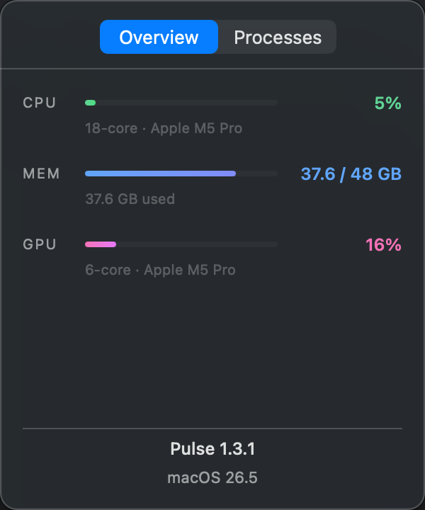
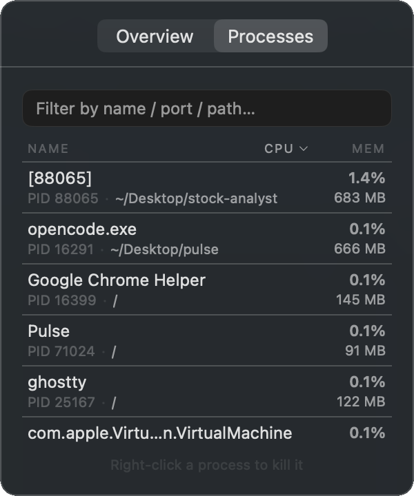
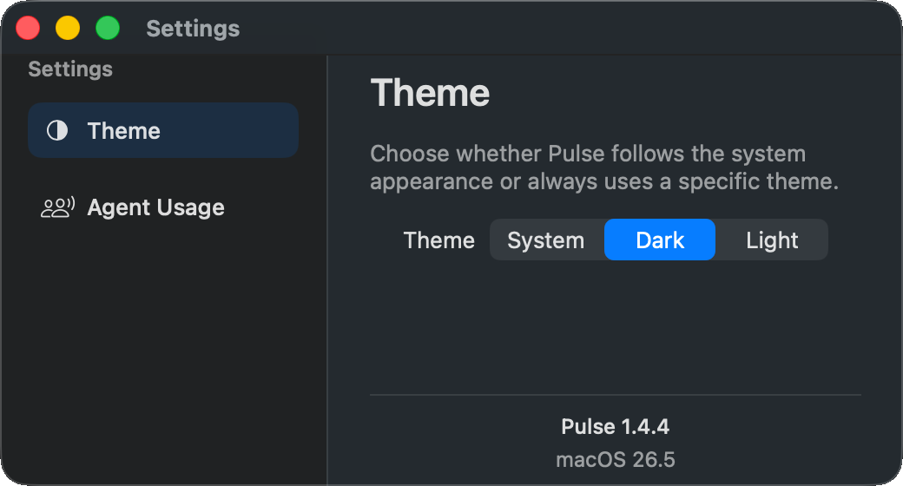
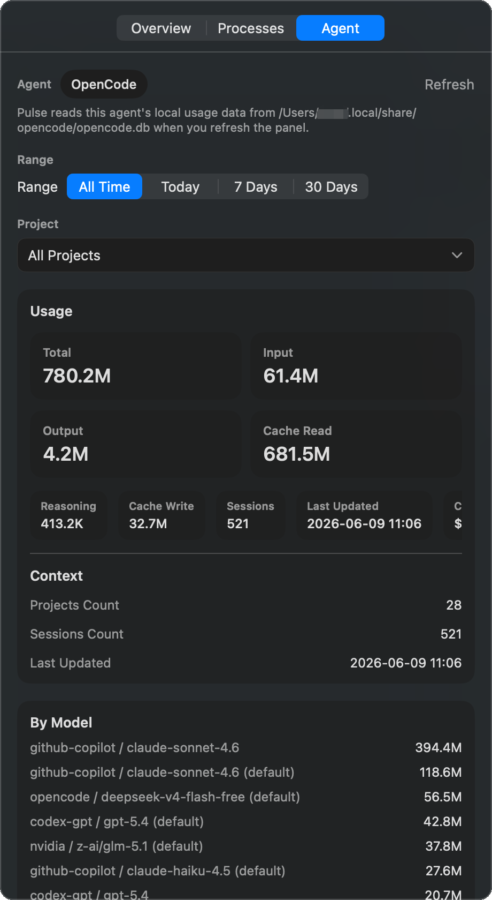

# Pulse

A macOS menu bar app for system monitoring, process management, local agent usage analysis, and live Agent Light session status for OpenCode and Codex.


---

## Preview

<table align="center">
  <tr>
    <td valign="middle">
      
    </td>
    <td valign="middle">
      
    </td>
    <td valign="middle">
      
    </td>
  </tr>
  <tr>
    <td valign="middle">
      
    </td>
  </tr>
</table>

---

## Installation

Download the latest `.dmg` from the [Releases](https://github.com/Re-Jacky/pulse/releases) page, open it, and drag **Pulse.app** to the Applications shortcut inside.

> [!IMPORTANT]
> **If macOS blocks the app on first launch** with a message like *"Apple could not verify Pulse is free of malware"*, run this in Terminal after dragging to Applications:
>
> ```bash
> xattr -dr com.apple.quarantine /Applications/Pulse.app
> ```
>
> Then open Pulse normally from Applications.

---

## Features

- **Lightweight & focused** — no bloat, only what you need for system monitoring and process management
- **Menu bar icon** — left-click opens/closes the panel; right-click shows a context menu with Open, Settings, and Quit
- **Agent Light** — live menu bar lights for OpenCode and Codex sessions with per-agent panels, parent/subagent aggregation, install management, and event-driven status updates
- **Overview tab** — animated gradient bars for CPU, Memory, and GPU with chip name and core count
- **Processes tab** — live process list with CPU%, memory, and listening ports; search by **name, working directory, or port**; sort by name, CPU, or memory; kill any process
- **Theme switching** — choose **System**, **Dark**, or **Light** in Settings; the preference is persisted in `UserDefaults`
- **Agent Usage tab** — optional OpenCode and Codex CLI token analysis with **All**, **OpenCode**, and **Codex** source picker; global, project, and session scopes; searchable selectors; `All Time`, `Today`, `7 Days`, and `30 Days` filters; model breakdown at global/project scope (not available in All mode)
- **Integration install flow** — install or remove the Pulse-managed OpenCode plugin and Codex hook directly from the Agent Light panel
- **Settings window** — reusable native macOS settings window, available from the menu or `Cmd+,`
- **Agent Usage toggle** — disabled by default in Settings; enabling it adds the `Agent` tab and expands the panel for the denser layout
- **Frosted glass panel** — `NSVisualEffectView` background with rounded corners and semantic colors for both dark and light appearance
- **Resizable panel** — drag any edge to resize; green button zooms to 1.5x width / 2x height
- **DMG distribution** — one-command build to a drag-to-install `.dmg`
- **Zero dependencies** — pure Apple APIs only (Mach, IOKit, BSD proc)

---

## Requirements

| Tool | Version |
|------|---------|
| macOS | 14.0 Sonoma or later |
| Xcode | 15 or later |

No package manager, no CocoaPods, no Swift packages required.

---

## Building

### Option 1: Xcode GUI

1. Open `pulse.xcodeproj` in Xcode
2. Select the `pulse` scheme and your Mac as the destination
3. Press **⌘R** to build and run

### Option 2: Command Line (Debug)

```bash
xcodebuild -project pulse.xcodeproj -scheme pulse -configuration Debug build

open "$(find ~/Library/Developer/Xcode/DerivedData -name 'Pulse.app' -path '*/Debug/*' | head -1)"
```

> **Note:** On first build you may need to run `sudo xcodebuild -runFirstLaunch` if Xcode tools aren't initialized.

### Option 3: Build a DMG for distribution

```bash
bash scripts/build-dmg.sh
```

Builds a Release `.app` and packages it into release artifacts using only macOS built-in tools (`hdiutil` — no Homebrew required).

Outputs:
- `dist/Pulse-<version>.dmg`
- `dist/Pulse-<version>-updater.zip`

To install: open the DMG, drag `Pulse.app` to the **Applications** shortcut inside it.

## GitHub Release Workflow

The repository includes a manual GitHub Actions release workflow.

To publish a release:

1. Bump `MARKETING_VERSION` in `pulse.xcodeproj/project.pbxproj`
2. Push the change to GitHub
3. Open the **Actions** tab
4. Run the **Release** workflow manually

The workflow will:

- read the current `MARKETING_VERSION`
- build the app with `bash scripts/build-dmg.sh`
- create a GitHub Release tagged `v<version>`
- upload:
  - `Pulse-<version>.dmg`
  - `Pulse-<version>-updater.zip`

If the release tag already exists, the workflow fails and requires a new version bump.

---

## Running

1. A **chip icon** appears in your menu bar
2. **Left-click** the icon to open the panel
3. **Overview tab** — CPU / Memory / GPU bars refresh every 2 seconds
4. **Processes tab** — type in the search box to filter by name, path, or port; click column headers to sort; right-click any row to kill it
5. Open **Settings** to switch between System, Dark, and Light themes, and optionally enable **Agent Usage**
6. If enabled, use the **Agent tab** to inspect agent usage across **All** sources or a specific source (OpenCode / Codex) by time range, project, and session, or refresh the local DB snapshot manually
7. If enabled, use **Agent Light** to install integrations, monitor live OpenCode and Codex session state, and inspect active sessions in the dedicated per-agent panel
8. **Click anywhere outside** the panel to dismiss it
9. **Right-click** the menu bar icon for Open/Close, Settings, and Quit

The app runs as a background accessory (`LSUIElement = true`) — no Dock icon, no ⌘-Tab entry.

---

## Project Structure

```
pulse/
├── App/
│   ├── main.swift              # AppKit entry point
│   └── AppDelegate.swift       # NSStatusItem, InputPanel, context menu
├── Managers/
│   ├── AppVersionInfo.swift          # Formats app and macOS version strings for Settings
│   ├── AgentIntegrationManager.swift # Installs and verifies OpenCode plugin / Codex hook integrations
│   ├── AgentSessionLightColor.swift  # Shared light color mapping used across UI
│   ├── AgentStatusStore.swift        # Live session-slot store and subagent aggregation
│   ├── AgentUsageSettings.swift      # Persists whether Agent Usage is enabled
│   ├── AgentUsageModels.swift        # Shared types — AgentSource, AgentTimeRange, AgentScope, AgentUsageSummary
│   ├── AgentUsageStore.swift         # Enum-routed ObservableObject combining both sources
│   ├── CodexHooksManifest.swift      # Merges Pulse-managed Codex hooks into hooks.json
│   ├── CodexIntegrationInstaller.swift # Generates the Codex hook installer payload
│   ├── OpenCodeUsageModels.swift     # OpenCode-specific session records, snapshot, model breakdown
│   ├── OpenCodeUsageStore.swift      # OpenCodeUsageQuery enum — SQLite queries + DB path detection
│   ├── OpenCodeIntegrationInstaller.swift # Generates the OpenCode plugin installer payload
│   ├── PulseAgentEventSenderTemplate.swift # Shared event sender used by integrations
│   ├── PulseAgentStatusServer.swift  # Local loopback server for live agent events
│   ├── CodexUsageModels.swift        # Codex-specific session records, snapshot, subagent edges, goals
│   ├── CodexUsageQuery.swift         # Codex SQLite queries + DB path detection (scans state_*.sqlite)
│   └── ThemeManager.swift            # AppTheme enum + persisted theme preference
├── Monitors/
│   ├── SystemMonitor.swift     # ObservableObject, 2s timer, coordinates all monitors
│   ├── CPUMonitor.swift        # Mach host_processor_info
│   ├── MemoryMonitor.swift     # host_statistics64
│   ├── GPUMonitor.swift        # IOKit IOAccelerator
│   └── ProcessMonitor.swift    # BSD proc APIs, port detection, kill
├── Views/
│   ├── Colors.swift            # Color(hex:) extension + palette
│   ├── MetricRowView.swift     # Animated gradient bar component
│   ├── OverviewView.swift      # CPU / Memory / GPU overview
│   ├── AgentUsageView.swift          # OpenCode + Codex usage UI, filters, cards, model breakdown
│   ├── AgentStatusManagementView.swift # Agent Light management and session detail panel
│   ├── AgentSourcePicker.swift       # Three-way capsule toggle (All / OpenCode / Codex)
│   ├── CodexSessionDetailView.swift  # Subagent edges + goals for a Codex session
│   ├── MenuBarStatusItemView.swift   # Agent Light menu bar item with grouped agent hit regions
│   ├── PopoverView.swift             # Root view, tab switcher, NSVisualEffectView
│   ├── ProcessListView.swift   # Filterable, sortable process table
│   ├── ProcessRowView.swift    # Per-process row with kill context menu
│   ├── SearchableSelectorView.swift # Searchable selector used by Agent Usage
│   └── SettingsView.swift      # Native settings window with theme selector and version info
└── scripts/
    ├── build-dmg.sh            # hdiutil-based DMG packager
    └── fix_screenshot_corners.py # Makes rounded-corner screenshot bleed transparent
```

### Screenshot Asset Cleanup

If a preview PNG shows dark/black corner bleed around a rounded screenshot, run:

```bash
python3 -m pip install pillow
python3 scripts/fix_screenshot_corners.py docs/images/preview-agent.png
```

You can pass multiple PNGs at once:

```bash
python3 scripts/fix_screenshot_corners.py docs/images/preview-overview.png docs/images/preview-processes.png docs/images/preview-settings.png
```

The script updates files in place and makes corner-connected dark bleed pixels transparent.

---

## How It Works

| Layer | API Used |
|-------|----------|
| CPU usage | `host_processor_info` (Mach) |
| Memory | `host_statistics64` (Mach) |
| GPU usage | `IOKit` — `IOAccelerator` performance statistics |
| Process list | `proc_listallpids` + `proc_pidinfo` (BSD) |
| Port detection | `proc_pidfdinfo` with `PROC_PIDFDSOCKETINFO` |
| Kill | `kill(pid, SIGTERM)` |

---

## Panel Behavior

The main window is an `InputPanel` (custom `NSPanel` subclass) rather than the standard `NSPopover`:

- **Resizable** — drag any edge/corner
- **Rounded corners** — 12pt radius via `CALayer`, window background is transparent
- **Theme-aware** — follows the selected app theme (`System`, `Dark`, or `Light`) across the panel and settings window
- **Keyboard focus** — `canBecomeKey` overridden to `true`; activation policy briefly switches to `.regular` on open then back to `.accessory` (no Dock icon)
- **Dismiss on outside click** — global `NSEvent` monitor closes the panel on any click outside it
- **Adaptive size** — expands in width when Agent Usage is enabled and expands in height while the `Agent` tab is active

---

## Settings

- Open **Settings...** from the menu bar icon's right-click menu or press `Cmd+,`
- Choose between **System**, **Dark**, and **Light** themes
- Enable or disable **Agent Usage**; it is off by default
- Theme changes are applied to both the main panel and the settings window immediately
- The selected theme and Agent Usage UI state are persisted between launches

---

## Agent Usage

- Supports **OpenCode** and **Codex CLI** with a three-way source picker (**All** / **OpenCode** / **Codex**)
- **All** mode merges usage from both sources in-memory, shows a combined summary and unioned project list, and hides session selector, context, and model breakdown
- Reads usage from local SQLite databases on demand
- **OpenCode** DB auto-detection (in order):
  - `OPENCODE_DB_PATH`
  - `XDG_DATA_HOME/opencode/opencode.db`
  - `~/.local/share/opencode/opencode.db`
  - `~/Library/Application Support/opencode/opencode.db`
  - Uses the most recently modified existing candidate
- **Codex** DB auto-detection (in order):
  - `CODEX_DB_PATH` (must exist)
  - Scans `~/.codex/` for `state_*.sqlite` files — picks the highest version number, ties broken by most recently modified
  - Returns `nil` if no DB is found (Codex is optional)
- Supports these scopes:
  - `All Projects`
  - one selected project
  - one selected session inside a project (not available in All mode)
- Supports these time ranges:
  - `All Time`
  - `Today`
  - `7 Days`
  - `30 Days`
- Shows token details for:
  - total
  - input
  - output
  - reasoning
  - cache read
  - cache write
- Includes a **By Model** breakdown for global and project scopes (not available in All mode or session scope)
- **Codex-specific**: subagent edge tracking, goal/budget display, reasoning effort
- Does not auto-refresh in the background; load happens when the panel becomes visible or when you press **Refresh**

## Agent Light

- Supports **OpenCode** and **Codex** live session lights in the menu bar
- Uses a Pulse-managed OpenCode plugin at `~/.config/opencode/plugins/pulse-agent-lights.ts`
- Uses a Pulse-managed Codex hook at `~/.codex/hooks/pulse-agent-lights-hook.sh` with merged entries in `~/.codex/hooks.json`
- Keeps the model event-driven: Pulse does not poll databases or logs for live session state
- Shows only top-level sessions as visible rows
- Aggregates real subagent work back into the parent session, so a parent stays `working` while any child is still active
- Treats subagent errors as child-local and does not promote the parent to `error`
- Includes inline install guidance:
  - OpenCode: restart OpenCode after install so the plugin is loaded
  - Codex: manually trust or enable the Pulse hook in Codex after install

Implementation notes and integration details live in [docs/architecture/agent-status-integrations.md](docs/architecture/agent-status-integrations.md).

---

## Permissions

Killing processes owned by other users requires elevated privileges. The app will silently fail on processes it doesn't own — this is intentional and safe.

---

## License

MIT
